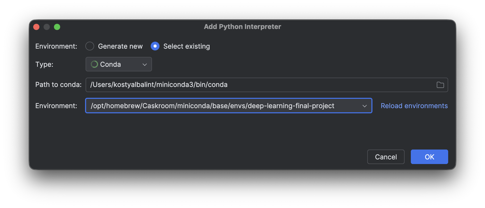

# 02456-deep-learning-final-project
DINOv3 based anomaly detection on MVTech dataset

## Development (create conda environment)

```bash
conda create --name deep-learning-final-project --file requirements.txt python=3.12
```

And activate it in the CLI

```bash
conda activate deep-learning-final-project
```

Also, depending on the IDE you use, it might be worth activating it there as well. In PyCharm, 
select envs in the bottom right, and then activate this new conda environment



When a new dependency is added to the project, save the dependency list to the `requirements.txt` with:

```bash
conda list -e > requirements.txt
```